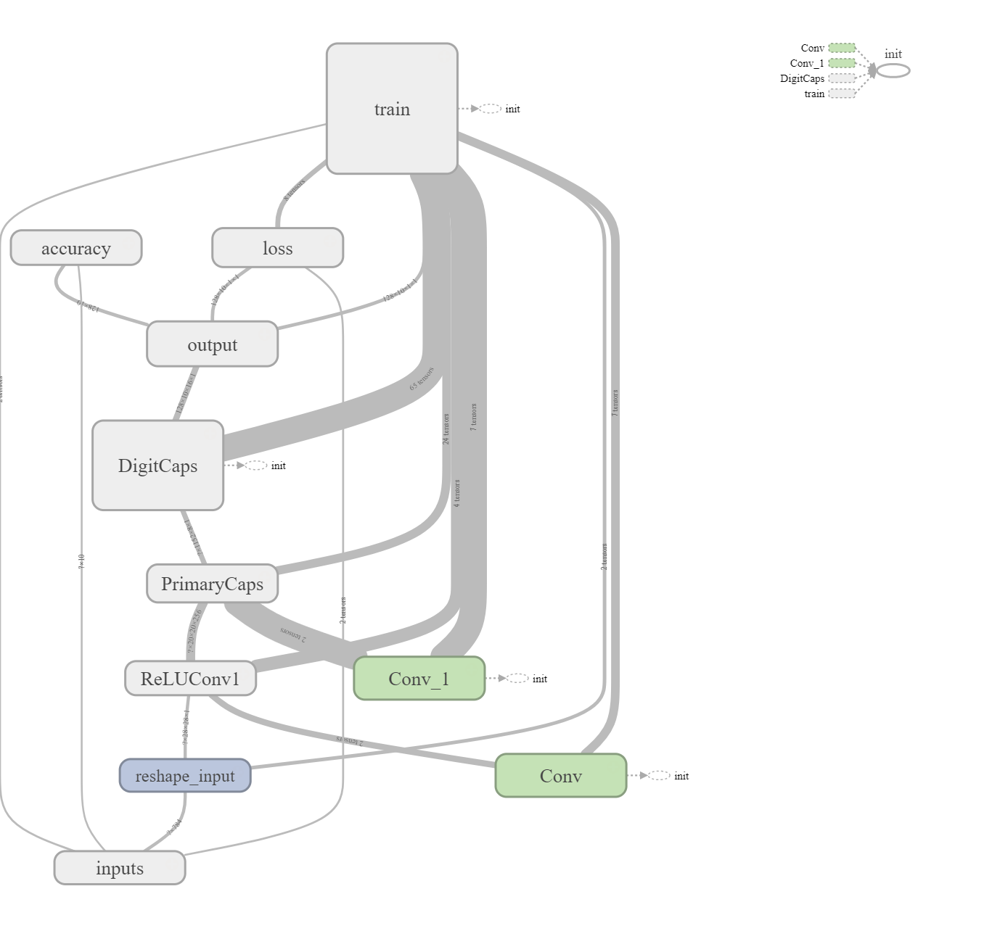

# CapsuleNetworks-TensorFlow
This is my implementation of Capsule Networks from this paper [Dynamic Routing Between Capsules](https://arxiv.org/abs/1710.09829). 
The entire source code is based on TensorFlow. I have put it in a jupyter notebook for easy reading. 

## The Network
As told in the paper, Capsule networks aim to understand equivariance in images. This is achieved via the Dynamic Routing algorithm. There is further explanation of in the source code. Here is a high level view of all the layers in the Neural Network.


## Packages Needed
* tensorflow-gpu
* numpy
In case you don't have them just run from your terminal/ favourite shell/ powershell:
pip install numpy tensorflow-gpu

In case you are using Anaconda like me :), you already have numpy, so just run the following command:
conda install tensorflow-gpu

## To-Do
Support has not been added for the reconstruction process shown in the paper, the implementation is only for classification as of now.

## To Run
Open the jupyter notebook and run all the cells.
```bash
$ jupyter notebook
```
Run all cells.

## To see visualizations
Run the following command on your terminal / favourite shell/ powershell

```bash
$ tensorboard --logdir="/logs_output_1" --host=localhost
```
You can see the visuals on [localhost:6006](http://localhost:6006)

## Hyper Parameters & Results
The model has been tuned to the following hyper parameters:
* batch_size = 128
* epochs = 10
* num_iters = 3 (Number of routing iterations.)
* Average test accuracy obtained is 99.1%

## Who am I?
I am Sri Vishnu Kumar Karlapati, currently pursuing MSc in Computer Science at The University of Oxford. I am a Machine Learning and Deep Learning enthusiast. I like to call myself a Full-Stack AI Developer =). 
Feel free to email me on [srivishnukumar.k@gmail.com](mailto:srivishnukumar.k@gmail.com), if you have any queries or if you would like to make any suggestions. I would love to make my code better.

## References & Thanks
I have referred to the following repositories for ideas and when I was stuck on implementation.
* [naturomics](https://github.com/naturomics/CapsNet-Tensorflow)
* [XifengGuo](https://github.com/XifengGuo/CapsNet-Keras)
* I would like to thank [Siraj Raval](https://www.youtube.com/watch?v=VKoLGnq15RM) for introducing me tho Capsule Networks.